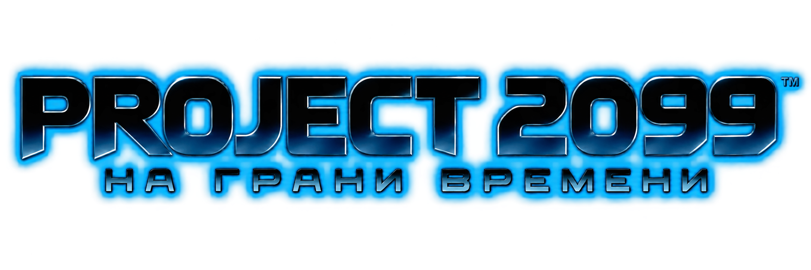

  

# Project 2099 — V2 BETA 1 TEST

**Две эпохи. Один полноценный PC-порт.**

Project 2099 переносит Xbox 360-версию *Spider-Man: Edge of Time* на Windows через статическую рекомпиляцию ReXGlue и добавляет то, чего у консольного релиза не было: клавиатуру и мышь, современный лаунчер, PC-настройки, локализацию, достижения, графические исправления и безопасную систему модов.

Это не готовая официальная игра и не сборник игровых данных. Для установки нужна совместимая собственная копия Xbox 360-версии. Репозиторий содержит установщик, инструменты и проектный код; полный образ игры сюда не входит.

## Что изменилось в V2

### Установка без ебучих плясок

- Один экран вместо цепочки из девяти страниц.
- ISO, ZIP, распакованную папку или поддерживаемый GOD/SVOD можно выбрать кнопкой либо перетащить в окно.
- Корень с `Default.xex` и `Data` ищется внутри вложенных каталогов автоматически.
- Payload берётся из указанного файла, папки рядом с EXE, проверенного кэша, ZIP рядом/в загрузках, основной ссылки или зеркала — именно в таком порядке.
- Полностью офлайн-установка работает, если положить `EOT-PC-Payload-v2.0.0-beta.1.zip` рядом с установщиком.
- Каждый источник, патч и собранная языковая ветка проверяются по размеру и SHA-256 до переноса в конечную папку.

### Настройки, которые действительно относятся к PC

- Разрешения от 1280×720 до 3840×2160, включая 21:9 3440×1440.
- Полный экран или окно, VSync, выбор монитора и GPU.
- Лимиты 30/60/75/120 FPS.
- Анизотропная фильтрация до 16× и отдельная детализация текстур вдали.
- Настраиваемый аудиобуфер для слабых CPU, Bluetooth и систем с треском звука.
- Полное переназначение клавиатуры и мыши, чувствительность, XInput/SDL и вибрация.
- Русский, English, Deutsch, Français, Italiano и Español.
- Импорт и экспорт профилей настроек без сейвов, токенов и игровых данных.

Выход в 4K поддерживается как разрешение окна/экрана. Внутренний 3D-рендер выше родного всё ещё экспериментален: надпись «4K» в меню сама по себе не является доказательством честного 4K всей сцены.

### Менеджер модов

`ModManager.exe` входит в V2 и открывается прямо из раздела «Моды» лаунчера.

- Принимает ZIP, 7Z, RAR, папки модов и совместимые `.pak`, `.pkz`, `.png`.
- Показывает описание, автора, версию, язык и список файлов.
- Позволяет включать, отключать и менять порядок модов.
- Предупреждает о конфликте, если несколько модов подменяют один файл.
- Собирает отдельный overlay `Mods\_active`; исходные пакеты игры остаются нетронутыми.
- Учитывает активную ветку `Data\Russian` или `Data\Original`.
- Может конвертировать совместимые **текстурные** PS3/Wii-скины в Xbox-раскладку. Модели, скрипты, исполняемый код и несовместимые форматы отклоняются, а не «магически устанавливаются».

### Производительность

- Новый D3D12-конвейер получает ограниченный бюджет ожидания на кадр; остальная сборка уходит в фон.
- Число фоновых PSO-сборщиков увеличено для многоядерных CPU.
- HDR-конвейер масштабирования создаётся при старте, а не во время первого тяжёлого кадра сцены.
- Фиксированная 100-мс задержка отложенных операций заменена на настраиваемое значение, по умолчанию 8 мс.
- В лог добавлена периодическая статистика кадра и отложенных рисований.

Это не обещание одинакового FPS на любом железе. Сцены, которые впервые создают большой набор поверхностей, всё ещё могут проседать; Vulkan пока не является рабочим релизным путём. Основной режим V2 — D3D12.

## Поддержать Project 2099

Проект остаётся бесплатным. Если хотите помочь с хостингом, инструментами и следующими сборками:

- **[Boosty — ранний доступ и чат, 300 ₽](https://boosty.to/genrythefox)**
- **[DonationAlerts](https://www.donationalerts.com/r/genrythefoxmax)**
- **[DonatePay](https://donatepay.ru/don/1411886)**
- **[Patreon](https://www.patreon.com/cw/GenryTheFox)**

Лаунчер содержит те же прямые HTTPS-адреса и не принимает платёжные данные. Донат ничего не разблокирует внутри игры и не заменяет собственную копию исходного релиза.

Новости и бесплатные релизы: **[Telegram](https://t.me/teamgenrythefox)** · обсуждение и баг-репорты: **[Discord](https://discord.gg/vrCTtBgjt)**.

## English summary

Project 2099 is an independent Windows recompilation of the Xbox 360 version of *Spider-Man: Edge of Time*. V2 adds a one-screen offline-capable installer, keyboard and mouse controls, a modern settings launcher, six interface languages, local achievements, graphics and performance work, and a language-aware mod manager.

The installer accepts a compatible ISO, ZIP, extracted folder or supported GOD/SVOD source supplied by the user. No disc image or complete game-data tree is included in this repository. D3D12 is the supported rendering path; Vulkan and high internal render scales remain experimental.
