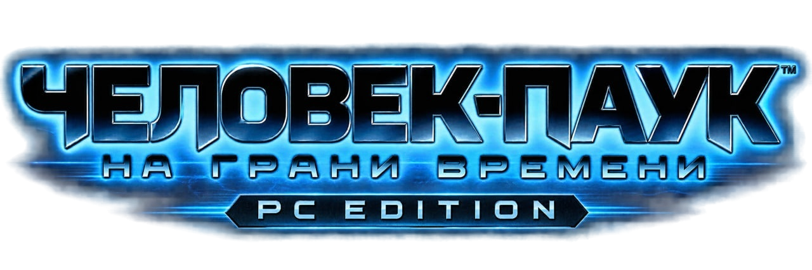

  

<h1 align="center">Spider-Man: Edge of Time — PC Edition</h1>

<strong>Two Eras. One Destiny.</strong>

  <a href="https://github.com/GenryTheFox/Spider-Man-Edge-of-Time-PC-Edition/releases">Downloads</a> ·
  <a href="#installation">Installation</a> ·
  <a href="#known-issues">Known issues</a> ·
  <a href="https://t.me/teamgenrythefox">Telegram</a> ·
  <a href="https://www.donationalerts.com/r/genrythefoxmax">DonationAlerts</a> ·
  <a href="https://donatepay.ru/don/1411886">DonatePay</a>

This is an unofficial Windows edition of **Spider-Man: Edge of Time (2011)**, powered by ReXGlue and rebuilt around the things a proper PC release actually needs.

The game launched on Xbox 360, PlayStation 3, Wii, Nintendo DS and Nintendo 3DS. Windows never got a version. That pissed me off for years, so I finally did something about it.

## What this is

Edge of Time ties Peter Parker and Miguel O’Hara together across two eras: what one Spider-Man changes, the other has to survive. This PC Edition brings the Xbox 360 release to Windows through ReXGlue-based recompilation, then builds a proper PC layer around it: an installer, a launcher, keyboard and mouse controls, localization, local achievements and graphics fixes.

The idea is dead simple: **download → install → launch → play.**

You provide a compatible Xbox 360 copy; the installer does the ugly work and builds the PC Edition. No pile of BAT files. No twenty-page setup ritual.

This public repository contains the **standalone installer and its tools**. The PC runtime ships as a separate release component; its full source tree is outside this repository.

## Version and release status

**V1 Beta — installer version `v1.0.0-beta.2`.**

I have completed the story from beginning to end on the development setup. Other hardware can still expose bugs, especially in rendering and frame pacing.

Download the build only from [GitHub Releases](https://github.com/GenryTheFox/Spider-Man-Edge-of-Time-PC-Edition/releases). If the release page has no attached files, there is no public build yet. The online installer also needs the matching payload ZIP under the exact tag and filename it was built for.

### Known issues

- Microstutter, particularly during some scene and level transitions.
- Occasional **severe freezes**, including on powerful PCs.
- White textures or white scene rendering on some Intel integrated graphics configurations. A tested rollback candidate did **not** resolve this issue and was withdrawn.
- Remaining rendering inconsistencies and white elements in parts of the settings UI.
- Audio breakup can still occur on weaker systems.
- Experimental graphics add-ons can introduce hardware-specific problems.

These are real beta limitations. I would rather put them here than pretend the remaining shit is just cosmetic.

## PC controls

- Keyboard and mouse support, including WASD movement.
- Mouse-button bindings and adjustable sensitivity.
- Rebindable controls.
- XInput controller support.
- Dynamic keyboard and mouse QTE artwork.
- Xbox button artwork when switching to a controller.
- PC control settings integrated into the game's interface as well as the launcher.

With the default bindings, QTE prompts follow the active input method: **B ↔ E** and **Y ↔ MMB**.

**MMB is a click on the mouse wheel.** Scrolling it does fuck all here.

## Windows launcher

The launcher handles resolution, display mode, VSync, frame-rate limits, monitor and GPU selection, filtering, language, controls, saves and local achievements.

Start the game through `Launcher.exe`; it launches `SpiderManEOT.exe`. The installer remains separate from the installed game.

The limiter offers values up to **120 FPS**. Whether the game actually reaches them depends on the scene, hardware and settings.

Transition stutter and frame pacing remain major targets for V2.

## Graphics work

A huge part of development went into restoring the look of the original game: transparency, glass, lighting, motion, combat effects and Spider-Man abilities. Edge of Time itself remains the reference — the move to Windows should preserve its atmosphere instead of sanding it into some generic remaster.

Work on Spider-Man 2099's scanning effects and the remaining rendering discrepancies continues. Shader caching reduces repeated compilation work, although some freezes remain.

## Languages

The installer and PC Edition support:

| Language | In-game ID |
| --- | --- |
| English | 1 |
| Deutsch | 2 |
| Français | 3 |
| Italiano | 4 |
| Español | 5 |
| Русский | 12 |

Russian and the five original languages are installed together. Available voice tracks still depend on the data present in the original copy.

The Russian translation is unofficial. The PC Edition includes localization integration and substantial Cyrillic font work around the game's original visual style.

That work covers **SANSA and TEMPUS**, glyph proportions, spacing, alignment and UI compatibility. The goal is for Russian text to look at home in a game from 2011, rather than like a font someone threw in at the last fucking minute.

When the alternate Russian donor is recognized, the installer reconstructs the accepted PC Edition target files instead of carrying its older localization into the finished build unchanged.

## Local achievements

The project includes a local achievement system with **47 achievements and 1,000 points**, icons, names, descriptions, locked/unlocked states, notifications and saved progress.

These are local PC Edition achievements. They do not synchronize with Xbox Live or Steam.

## Experimental DLSS 5 integration

The project also includes an optional experimental graphics package labeled **DLSS 5**, built around ReShade, Feeder, RenoDX and NVIDIA components.

Yes, I went down that rabbit hole with a fucking Xbox 360 game from 2011.

NVIDIA does not officially support this port, compatibility varies by GPU, and the regular D3D12 game remains available with the package disabled.

## Installation

1. Download the installer attached to the matching GitHub Release.
2. Let it download and verify the matching PC Edition support package.
3. Select a supported local Xbox 360 source.
4. Choose an empty destination folder and complete installation.
5. Start the installed `Launcher.exe`.

The intended input formats are XDVDFS ISO, an extracted game folder containing `Default.xex` and `Data`, and supported GOD/SVOD containers. A GOD source can also be selected through its `415608B2/00007000` folder.

**A container extension or header alone is not enough.** The current reader handles SVOD/GOD; it does not support every STFS package that happens to start with LIVE, PIRS or CON.

**Supported donor revisions**

The installer recognizes two recorded file sets:

- `eu-retail`: the project's European baseline.
- `ru-god-alt`: the tested alternate Russian LIVE/XSF GOD.

Unknown or mixed revisions are rejected. ISO parsing is implemented; the recorded full installation test used the supplied GOD, not a separately verified retail ISO.

**Verification and recovery**

The installer verifies source-file hashes, stages the build in a temporary directory, checks the final output, resumes interrupted downloads through HTTP Range requests, reuses valid cached payloads and blocks unsafe ZIP paths. Only a fully verified installation is moved into the chosen destination.

Local checks included a complete GOD extraction, reconstruction of both language trees and **293 matching files in each tree**. A local SSD run completed installation in approximately **34 seconds**, excluding the Internet download. That is a measurement on the development machine, not a universal installation-time promise.

**What the release contains**

The public repository contains no ISO, GOD package or complete game-data tree, and the installer never searches the Internet for the original game.

The support package contains PC components and binary patches. Some patches include replacement bytes derived from game resources; changing the extension does not change what those bytes actually are. See [Third-Party Licenses](THIRD_PARTY_LICENSES.md) for the exact scope of the included notices.

## Why I made this

I wanted Edge of Time on PC long before I knew anything about recompilation, ReXGlue or the mess that comes with bringing a console game across.

I wanted to sit down, launch it and enjoy Peter and Miguel's story on Windows. That wish gradually turned into weeks of debugging, broken menus, wrong prompts, font problems and the occasional spectacular black screen.

Somewhere along the way, it became a project I wanted other people to enjoy too.

## Development and AI assistance

I used AI coding tools heavily during development, especially **OpenAI Codex and Astra**. I am not going to bullshit anyone and pretend otherwise. They helped with code, debugging, the installer, the launcher, log analysis and a mountain of experiments.

Still, AI output never counted as proof. “Fix implemented successfully” means fuck all if the game opens to a black screen. Every change had to survive a clean build, file verification and the actual game.

## Technology and acknowledgements

**ReXGlue** — [ReXGlue and its contributors](https://github.com/rexglue/rexglue-sdk) provide the major recompilation/runtime foundation used by this project. Their work made much of this possible.

**Xenia** — [Xenia](https://github.com/xenia-project/xenia) and the wider Xbox 360 emulation community established years of research that this work depends on.

**XenosRecomp** — [XenosRecomp](https://github.com/hedge-dev/XenosRecomp) is part of the wider Xbox 360 shader-recompilation ecosystem.

**Unleashed Recompiled** — [Unleashed Recompiled](https://github.com/hedge-dev/UnleashedRecomp) provided an important reference for a user-friendly installation flow.

These acknowledgements do not claim that this installer embeds their entire codebases or that every part of their renderer is used here.

**Another Edge of Time project: reeot**

[EdgeOfTime-Recompiled, codenamed **reeot**](https://github.com/goliathret/reeot), is a separate unofficial recompilation project. Its public README credits **Graine25**, **Serjar** and the ReXGlue team.

Their public README describes ReXGlue-based recompilation and work on a replacement renderer. Any old “no official release” warning there referred to reeot's own status at that point in development, not to every other fan-made Edge of Time build.

reeot is a separate project with its own releases and issue tracker. Send reports for this build here, respect their contribution rules, and give credit where it is due: more than one team is fighting to keep this game alive.

## Credits

**GenryTheFox** — project direction, PC integration, launcher and installer work, controls, QTE integration, localization and font work, graphics investigation, testing and release preparation.

**AI development assistance** — OpenAI Codex and Astra, used extensively for coding and debugging support.

**Original game** — developed by Beenox and originally published by Activision. Spider-Man and the related characters, artwork and trademarks belong to their respective rights holders.

Third-party authors retain their own credits and licenses. See [THIRD_PARTY_LICENSES.md](THIRD_PARTY_LICENSES.md) and [licenses/](licenses/).

## V2 roadmap

- Investigate transition stutter and severe freezes at their underlying causes.
- Improve compatibility, including the unresolved Intel white-rendering issue.
- Continue work on the experimental Vulkan branch. Vulkan will enter normal builds only when it can survive actual gameplay without device-loss errors, broken rendering and other ritualistic bullshit.
- Add a photo mode: free camera, pause, HUD visibility, FOV and camera rotation.
- Improve frame pacing, remaining effects and other PC-specific behavior.

That is the target for V2. I am not promising miracles across every possible PC, but these are the problems I intend to attack at the foundation.

## Other projects

Other work already on the table:

- Sonic Free Riders — PC Edition.
- Plants vs. Zombies.
- Console-to-PC work on Neighbours from Hell.
- Genry Mod Engine / Genry Mod Constructor for Everlasting Summer.
- Analog horror, videos and other port experiments.

The videos and Everlasting Summer are still alive. Edge of Time swallowed a ridiculous amount of time, but I am coming back to them.

## License

Code written for this installer and owned by the project authors is licensed under **GNU GPL version 3.0**. Third-party code, binaries, artwork, fonts and original game data keep their own licenses and ownership. See [LICENSE](LICENSE), [THIRD_PARTY_LICENSES.md](THIRD_PARTY_LICENSES.md) and [licenses/](licenses/).

The GPL covers the code I have the right to license. It does not magically turn Marvel, Beenox, Activision, NVIDIA or Xbox 360 game data into GPL material.

## Support development

The PC Edition is free. If it gave you a good evening and you want to help me keep fighting freezes, paying for hosting and building more unreasonable ports, the links are below:

- **[DonationAlerts](https://www.donationalerts.com/r/genrythefoxmax)**
- **[DonatePay](https://donatepay.ru/don/1411886)**

Nothing is locked behind a donation. It is simply a way to support the person still sitting here and beating this old game into a proper Windows release.

## Telegram — Склад Генри

**[Development updates, screenshots, videos and other projects](https://t.me/teamgenrythefox)**

News, screenshots, videos, experiments, failures, victories and all the rest of my bullshit — straight from me.

## Disclaimer

This is an unofficial fan project, unaffiliated with Activision, Beenox, Marvel, Microsoft or Xbox. No ownership of the original game or its intellectual property is claimed.

---

<strong>TWO ERAS. ONE DESTINY.</strong> 2011 → 2026 · Xbox 360 → Windows

The PC version never existed.

**Now it fucking does.**

*An unofficial fan-made PC Edition.*
