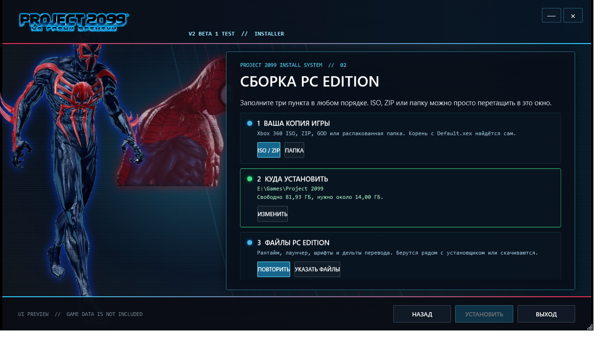

  

<h1 align="center">Project 2099: На грани времени</h1>

<strong>Две эпохи. Один полноценный PC-порт.</strong> Two eras. One proper PC port.

  <a href="https://github.com/GenryTheFox0/Project-2099/releases/tag/v2.0.0-beta.4.1">V2 BETA 4.1 download</a> ·
  <a href="#installation">Installation</a> ·
  <a href="INSTALLATION.md">Six-language guides</a> ·
  <a href="RELEASE_NOTES_BETA4_1.md">Installer hotfix</a> ·
  <a href="#known-issues">Known issues</a> ·
  <a href="https://t.me/teamgenrythefox">Telegram</a> ·
  <a href="https://discord.gg/2Yy45gJap3">Discord</a>

## Коротко по-русски

**Project 2099** — независимый Windows-порт *Spider-Man: Edge of Time (2011)*, собранный из Xbox 360-версии через ReXGlue. Это не ярлык для эмулятора и не архив с сотней BAT-файлов: проект добавляет собственный установщик, лаунчер, клавиатуру и мышь, PC-настройки, шесть языков, локальные достижения и графические исправления.

Игровые данные в репозитории не лежат. Пользователь указывает совместимую собственную копию Xbox 360-игры — **ISO, ZIP, распакованную папку или поддерживаемый GOD/SVOD** — а установщик проверяет источник и собирает готовую PC Edition.

**V2 BETA 4.1** — исправление установщика: проверка и восстановление неполного кэша PC Edition, понятная диагностика размера конкретного файла и удаление старых служебных заметок из устанавливаемого пакета. Языковые пакеты и игровой рантайм Beta 4 не менялись. Подробности — в [заметках хотфикса](RELEASE_NOTES_BETA4_1.md) и [заметках Beta 4](RELEASE_NOTES_BETA4_RU.md). Скачивайте файлы с [прямой страницы выпуска](https://github.com/GenryTheFox0/Project-2099/releases/tag/v2.0.0-beta.4.1) и проверяйте их по `SHA256SUMS.txt` из того же выпуска.

### Что нового в V2

- **Установщик на одном экране:** ISO/ZIP/папку можно выбрать или бросить мышкой в окно; payload можно скачать, указать вручную либо положить рядом для полностью офлайн-установки. Старая тупиковая ошибка 404 больше не должна блокировать установку.
- **Нормальные PC-настройки:** разрешения от 720p до 4K-вывода, окно/полный экран, VSync, 30/60/75/120 FPS, монитор, GPU, анизотропия до 16×, детализация текстур вдали, аудиобуфер, язык, мышь, геймпад и переназначение клавиш. Внутреннее масштабирование выше родного пока честно помечено экспериментальным.
- **Профили настроек:** выбранную графику, управление, звук и язык можно сохранить в отдельный JSON и перенести на другую установку без сейвов и игровых файлов.
- **Моды:** в лаунчере остаётся базовый раздел для включения и отключения уже подготовленных папок модов. Отдельный `ModManager.exe` временно не входит в публичную Beta 4. Я планирую выпустить новый менеджер отдельным приложением, включая установку с прямой заменой игровых файлов; это будущая работа, а не заявленная функция этой беты.
- **Работа с фризами:** ограниченное ожидание новых D3D12-конвейеров, фоновые PSO-сборщики, ранний прогрев HDR-конвейера и сокращённая задержка отложенных операций сохранения.

  

### Поддержать разработку

Project 2099 остаётся бесплатным. Добровольная поддержка проекта доступна прямо в `Launcher.exe`: на главном экране и в разделе «Проект». Платёжные ссылки намеренно не дублируются в описании репозитория. Лаунчер только открывает выбранный сервис, не принимает платёжные данные и ничего не разблокирует за донат.

Новости: **[Telegram](https://t.me/teamgenrythefox)** · обсуждение и баг-репорты: **[Discord](https://discord.gg/2Yy45gJap3)**.

## What this is

Edge of Time ties Peter Parker and Miguel O’Hara together across two eras: what one Spider-Man changes, the other has to survive. This PC Edition brings the Xbox 360 release to Windows through ReXGlue-based recompilation, then builds a proper PC layer around it: an installer, a launcher, keyboard and mouse controls, localization, local achievements and graphics fixes.

The idea is simple: **provide your copy → install → launch → play.**

You provide a compatible Xbox 360 copy; the installer does the ugly work and builds the PC Edition. No pile of BAT files. No twenty-page setup ritual.

This public repository contains the **standalone installer and its tools**. The PC runtime ships as a separate release component; its full source tree is outside this repository.

## Version and release status

**V2 BETA 4.1** is an installer hotfix: incomplete payload-cache recovery, file-specific size diagnostics, and a cleaner installed package. The Beta 4 runtime and language patches are unchanged. See the [hotfix notes](RELEASE_NOTES_BETA4_1.md), download from the [specific release](https://github.com/GenryTheFox0/Project-2099/releases/tag/v2.0.0-beta.4.1), and check the files against that release's `SHA256SUMS.txt`.

### V2 BETA 1 baseline

V2 attacks the two complaints that mattered most inside the runtime itself, not in a config file:

- **A shader pipeline compiled on the spot no longer owns a frame.** The GPU command thread now waits at most a per-frame budget (6 ms by default) for a new D3D12 pipeline; past that the draw moves to the next frame while eight background workers finish building it. Before this, one heavy pipeline could cost a 300 ms frame.
- **Checkpoint saves no longer freeze the game for 100 ms.** Deferred overlapped completions carried a fixed 100 ms sleep inherited from the emulator lineage, and this title waits on the result of its own save request. That delay is a setting now and defaults to 8 ms.
- **The HDR surface-scaling compute pipeline is built at start-up** instead of lazily inside the first frame of a new scene.
- **Texture detail at a distance** is a new graphics option (host mip LOD bias), alongside anisotropy up to 16x. Both belong to the sampler key, so a change applies on the next frame rather than after a return to the main menu.
- **A new installer.** One setup screen instead of a nine-step march, drag and drop for an ISO/ZIP/folder, an offline path that needs no GitHub at all, a free-space check before the install starts and a failure page that says what to do next.

Measured on the development machine (RTX 5060, 12 threads) after these changes: a 120 FPS target held with a median frame of 8.3 ms and p99 near 10 ms, zero in-frame pipeline builds across a session, and no 100 ms save hitch. Different hardware can still expose different problems.

Download the current installer from [V2 BETA 4.1](https://github.com/GenryTheFox0/Project-2099/releases/tag/v2.0.0-beta.4.1). This is published as a regular GitHub release; the game itself remains beta software with the limitations listed below. The generic latest endpoint remains on the runtime-update channel; use this direct link for the installer hotfix. If Beta 4 already installs and runs correctly, this installer-only hotfix does not require reinstalling the game or replacing saves.

### Known issues

- Scene transitions and the first seconds of a cutscene can still fall below the target while the renderer creates that scene's set of render targets. It settles after the first pass through a scene.
- White textures or white scene rendering on some Intel integrated graphics configurations. A tested rollback candidate did **not** resolve this issue and was withdrawn.
- Internal resolution above native is experimental and still needs a restart to apply.
- Vulkan is not usable yet; D3D12 is the supported path.
- Audio breakup can still occur on weaker systems.
- Experimental graphics add-ons can introduce hardware-specific problems.

These are real beta limitations. I would rather put them here than pretend the remaining shit is just cosmetic.

## PC controls

- Keyboard and mouse support, including WASD movement.
- Mouse-button bindings and adjustable sensitivity.
- Rebindable controls.
- XInput controller support.
- Dynamic keyboard and mouse QTE artwork.
- Xbox button artwork when switching to a controller.
- PC control settings integrated into the game's interface as well as the launcher.

With the default bindings, QTE prompts follow the active input method: **B ↔ E** and **Y ↔ MMB**.

**MMB is a click on the mouse wheel.** Scrolling it does fuck all here.

## Windows launcher

The launcher handles resolution, display mode, VSync, frame-rate limits, monitor and GPU selection, filtering, language, controls, saves and local achievements.

Start the game through `Launcher.exe`; it launches `SpiderManEOT.exe`. The installer remains separate from the installed game.

The limiter offers values up to **120 FPS**. Whether the game actually reaches them depends on the scene, hardware and settings.

Transition stutter and frame pacing remain major targets for V2.

## Graphics work

A huge part of development went into restoring the look of the original game: transparency, glass, lighting, motion, combat effects and Spider-Man abilities. Edge of Time itself remains the reference — the move to Windows should preserve its atmosphere instead of sanding it into some generic remaster.

Work on Spider-Man 2099's scanning effects and the remaining rendering discrepancies continues. Shader caching reduces repeated compilation work, although some freezes remain.

## Languages

The installer and PC Edition support:

| Language | In-game ID |
| --- | --- |
| English | 1 |
| Deutsch | 2 |
| Français | 3 |
| Italiano | 4 |
| Español | 5 |
| Русский | 12 |

Russian and the five original languages are installed together. Available voice tracks still depend on the data present in the original copy.

The Russian translation is unofficial. The PC Edition includes localization integration and substantial Cyrillic font work around the game's original visual style.

That work covers **SANSA and TEMPUS**, glyph proportions, spacing, alignment and UI compatibility. The goal is for Russian text to look at home in a game from 2011, rather than like a font someone threw in at the last fucking minute.

When the alternate Russian donor is recognized, the installer reconstructs the accepted PC Edition target files instead of carrying its older localization into the finished build unchanged.

## Local achievements

The project includes a local achievement system with **47 achievements and 1,000 points**, icons, names, descriptions, locked/unlocked states, notifications and saved progress.

These are local PC Edition achievements. They do not synchronize with Xbox Live or Steam.

## Experimental DLSS 5 integration

The project also includes an optional experimental graphics package labeled **DLSS 5**, built around ReShade, Feeder, RenoDX and NVIDIA components.

Yes, I went down that rabbit hole with a fucking Xbox 360 game from 2011.

NVIDIA does not officially support this port, compatibility varies by GPU, and the regular D3D12 game remains available with the package disabled.

## Installation

1. Download the installer attached to the matching GitHub Release.
2. Let it download and verify the matching PC Edition support package.
3. Select a supported local Xbox 360 source.
4. Choose an empty destination folder and complete installation.
5. Start the installed `Launcher.exe`.

For an online installation, download the installer from the same release as the matching payload. For an offline installation, place the matching payload ZIP beside the installer or select it in the installer. Do not mix installer and payload files from different beta versions.

Installation guides: [English](INSTALL_EN.md) · [Русский](INSTALL_RU.md) · [Deutsch](INSTALL_DE.md) · [Français](INSTALL_FR.md) · [Italiano](INSTALL_IT.md) · [Español](INSTALL_ES.md)

The input can be an XDVDFS ISO, a ZIP containing the game root, a ZIP containing a GOD image (the installer unpacks it itself onto a drive with room and checks every fragment's length), an extracted folder containing `Default.xex` and `Data`, an outer folder containing one compatible game root, or a GOD/SVOD container. A GOD image may be selected at any level a player is likely to click: the outer folder, the title-id folder, `00007000`, the container file itself or its `.data` directory. If a selected directory contains one ISO or ZIP, the installer opens it automatically.

After a successful installation, the source ISO, GOD or extracted folder is no longer needed. The PC Edition runs entirely from the chosen destination and is not tied to the source drive letter. Saves and installer caches use the current Windows user's profile rather than a developer-specific path.

**A container extension or header alone is not enough.** The current reader handles SVOD/GOD; it does not support every STFS package that happens to start with LIVE, PIRS or CON.

**Which dumps work**

The installer recognizes compatible Xbox 360 sources by file contents, including the level
packages that contain embedded dialogue. The language checks cover both shared text files
and scene subtitles. A container name, region label or matching `Default.xex` alone is not
enough to prove that its text files can be reconstructed correctly.

Recorded revisions, named on screen when they match:

- `usa-europe-retail` and `usa-europe-retail-r2`: two USA/Europe retail revisions.
- `eu-retail`: the PC Edition original-language baseline.
- `ru-god-alt`: an alternate Russian LIVE/XSF GOD carrying a machine translation.
- `sazanoff-rus-god`: Region Free RUS GOD (SazanOFF v1.0b).

The last two may contain altered Russian text and font encodings. Beta 4 reconstructs the
verified English, German, French, Italian and Spanish targets and preserves the accepted
Project 2099 Russian target. If a source package cannot be matched and reconstructed, the
installer reports that package instead of silently placing its text in the wrong language tree.

**Verification and recovery**

The installer verifies source-file hashes, stages the build in a temporary directory, checks the final output, resumes interrupted downloads through HTTP Range requests, reuses valid cached payloads and blocks unsafe ZIP paths. Only a fully verified installation is moved into the chosen destination.

The Beta 4 candidate completed a clean local installation from the supplied SazanOFF source; the resulting Original and Russian trees each contained **293 verified files**. Patch chains for the five recorded source families were checked separately. This does not establish compatibility with every modified dump or visual correctness in every chapter.

**What the release contains**

The public repository contains no ISO, GOD package or complete game-data tree, and the installer never searches the Internet for the original game.

The support package contains PC components and binary patches. Some patches include replacement bytes derived from game resources; changing the extension does not change what those bytes actually are. See [Third-Party Licenses](THIRD_PARTY_LICENSES.md) for the exact scope of the included notices.

## Why I made this

I wanted Edge of Time on PC long before I knew anything about recompilation, ReXGlue or the mess that comes with bringing a console game across.

I wanted to sit down, launch it and enjoy Peter and Miguel's story on Windows. That wish gradually turned into weeks of debugging, broken menus, wrong prompts, font problems and the occasional spectacular black screen.

Somewhere along the way, it became a project I wanted other people to enjoy too.

## Development and AI assistance

I used AI coding tools heavily during development, especially **OpenAI Codex and Astra**. I am not going to bullshit anyone and pretend otherwise. They helped with code, debugging, the installer, the launcher, log analysis and a mountain of experiments.

Still, AI output never counted as proof. “Fix implemented successfully” means fuck all if the game opens to a black screen. Every change had to survive a clean build, file verification and the actual game.

### Respect to the EdgeOfTimeRecompiled team

I want to publicly give respect to **Graine25** and **SerJar** for their work on **EdgeOfTimeRecompiled (reeot)**.

Project 2099 and reeot are two different projects with very different approaches. My project is heavily AI-assisted and built around my own modified ReXGlue setup, while reeot goes much deeper into manual reverse engineering and native rendering.

That difference does not make us enemies.

I respect the amount of time, knowledge and work they put into Edge of Time. I also personally learned useful things from talking with them, and I am thankful for the cooperation we already had around localization, fonts, textures and research.

When reeot releases, I genuinely want to play it myself. If they do something better than Project 2099, I have no problem saying that openly.

I also want people following Project 2099 to know that **reeot is a separate project and deserves its own attention**. I do not want anyone attacking their team in my name or turning this into another stupid “AI vs human” war.

There is enough room for both projects.

We are both trying to keep a 2011 Spider-Man game alive on modern PCs, just in completely different ways.

**Respect to Graine25, SerJar and everyone helping EdgeOfTimeRecompiled.**

## Technology and acknowledgements

**ReXGlue** — [ReXGlue and its contributors](https://github.com/rexglue/rexglue-sdk) provide the major recompilation/runtime foundation used by this project. Their work made much of this possible.

**Xenia** — [Xenia](https://github.com/xenia-project/xenia) and the wider Xbox 360 emulation community established years of research that this work depends on.

**XenosRecomp** — [XenosRecomp](https://github.com/hedge-dev/XenosRecomp) is part of the wider Xbox 360 shader-recompilation ecosystem.

**Unleashed Recompiled** — [Unleashed Recompiled](https://github.com/hedge-dev/UnleashedRecomp) provided an important reference for a user-friendly installation flow.

These acknowledgements do not claim that this installer embeds their entire codebases or that every part of their renderer is used here.

**Another Edge of Time project: reeot**

[EdgeOfTime-Recompiled, codenamed **reeot**](https://github.com/goliathret/reeot), is a separate unofficial recompilation project. Its public README credits **Graine25**, **Serjar** and the ReXGlue team.

Their public README describes ReXGlue-based recompilation and work on a replacement renderer. Any old “no official release” warning there referred to reeot's own status at that point in development, not to every other fan-made Edge of Time build.

reeot is a separate project with its own releases and issue tracker. Send reports for this build here, respect their contribution rules, and give credit where it is due: more than one team is fighting to keep this game alive.

## Credits

**GenryTheFox** — project direction, PC integration, launcher and installer work, controls, QTE integration, localization and font work, graphics investigation, testing and release preparation.

**AI development assistance** — OpenAI Codex and Astra, used extensively for coding and debugging support.

**Original game** — developed by Beenox and originally published by Activision. Spider-Man and the related characters, artwork and trademarks belong to their respective rights holders.

Third-party authors retain their own credits and licenses. See [THIRD_PARTY_LICENSES.md](THIRD_PARTY_LICENSES.md) and [licenses/](licenses/).

## V2 roadmap

- Investigate transition stutter and severe freezes at their underlying causes.
- Improve compatibility, including the unresolved Intel white-rendering issue.
- Continue work on the experimental Vulkan branch. Vulkan will enter normal builds only when it can survive actual gameplay without device-loss errors, broken rendering and other ritualistic bullshit.
- Add a photo mode: free camera, pause, HUD visibility, FOV and camera rotation.
- Improve frame pacing, remaining effects and other PC-specific behavior.

That is the target for V2. I am not promising miracles across every possible PC, but these are the problems I intend to attack at the foundation.

## Other projects

Latest development diary: [English](POST_EOT_COLLAB_BETA3_EN.md) · [Русский](POST_EOT_COLLAB_BETA3_RU.md)

Other work already on the table:

- Sonic Free Riders — PC Edition.
- Plants vs. Zombies.
- Console-to-PC work on Neighbours from Hell.
- Genry Mod Engine / Genry Mod Constructor for Everlasting Summer.
- Analog horror, videos and other port experiments.

The videos and Everlasting Summer are still alive. Edge of Time swallowed a ridiculous amount of time, but I am coming back to them.

## License

Code written for this installer and owned by the project authors is licensed under **GNU GPL version 3.0**. Third-party code, binaries, artwork, fonts and original game data keep their own licenses and ownership. See [LICENSE](LICENSE), [THIRD_PARTY_LICENSES.md](THIRD_PARTY_LICENSES.md) and [licenses/](licenses/).

The GPL covers the code I have the right to license. It does not magically turn Marvel, Beenox, Activision, NVIDIA or Xbox 360 game data into GPL material.

## Support development

Project 2099 is free. Voluntary support options are available directly inside `Launcher.exe`, both on its home screen and on the Project page. Payment links are intentionally not duplicated in the repository description. The launcher only opens the selected service and never handles payment details. A donation unlocks nothing in the game and is not required for public updates.

## Telegram — Склад Генри

**[Telegram — development updates, screenshots and releases](https://t.me/teamgenrythefox)** · **[Discord — Project 2099 discussion and bug reports](https://discord.gg/2Yy45gJap3)**

News, screenshots, videos, experiments, failures, victories and all the rest of my bullshit — straight from me.

## Disclaimer

This is an unofficial fan project, unaffiliated with Activision, Beenox, Marvel, Microsoft or Xbox. No ownership of the original game or its intellectual property is claimed.

---

<strong>TWO ERAS. ONE DESTINY.</strong> 2011 → 2026 · Xbox 360 → Windows

The PC version never existed.

**Now it fucking does.**

*An unofficial fan-made PC Edition.*
